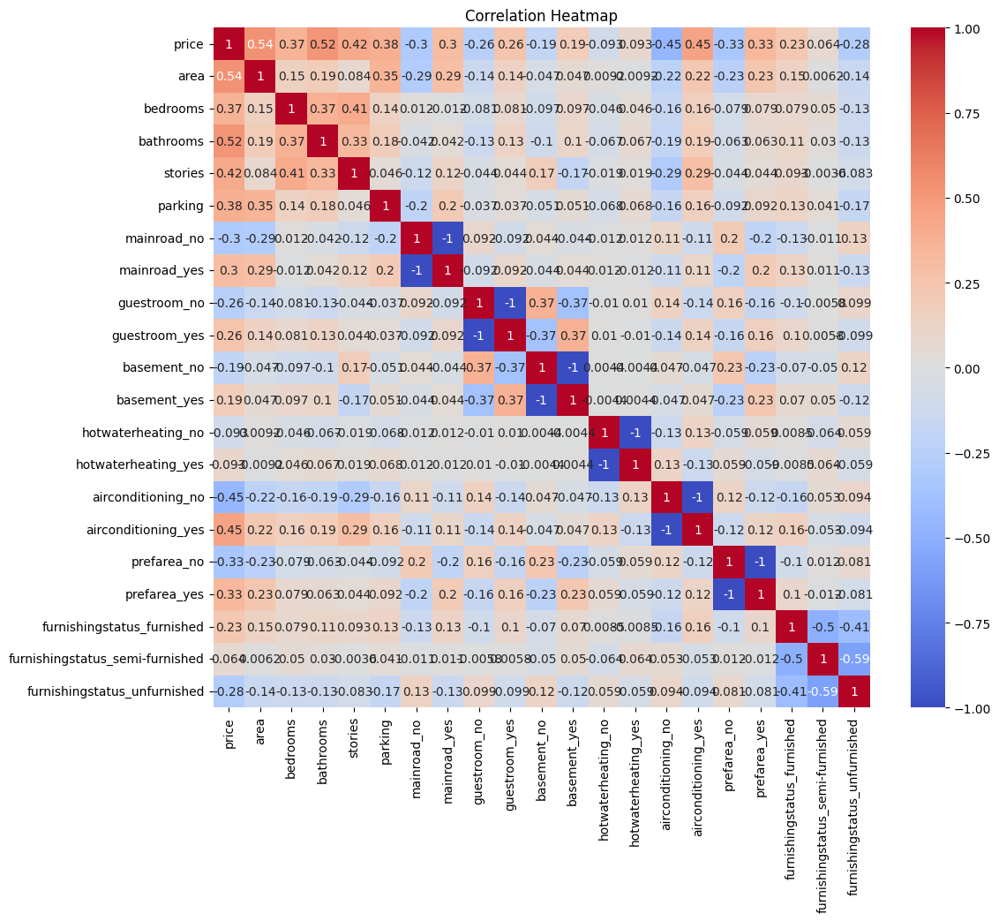
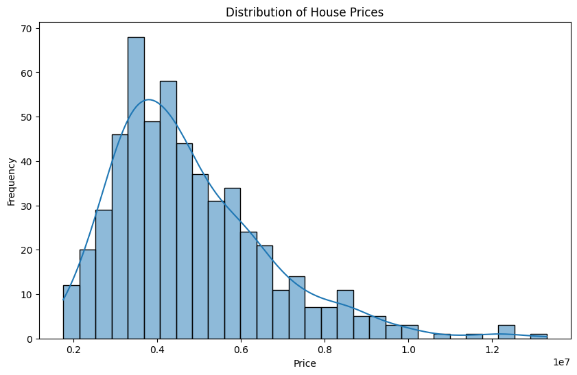
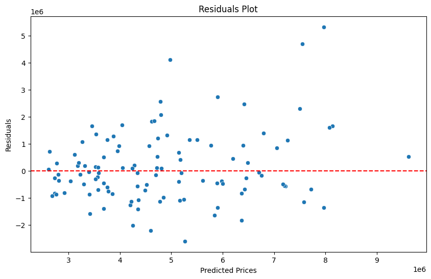
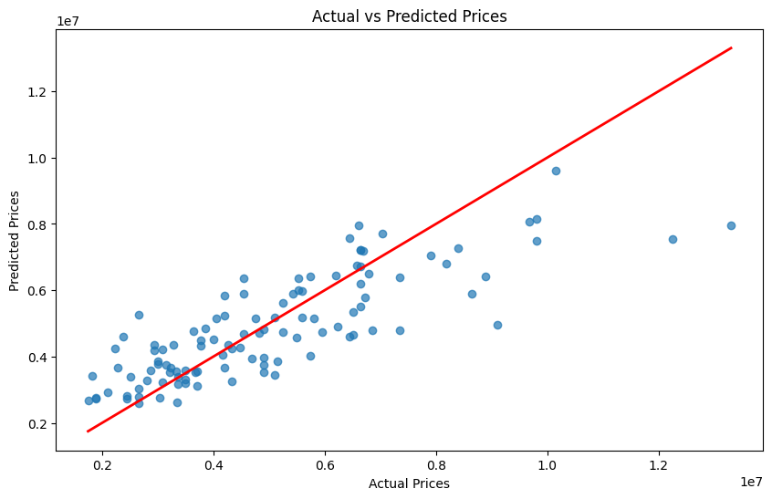
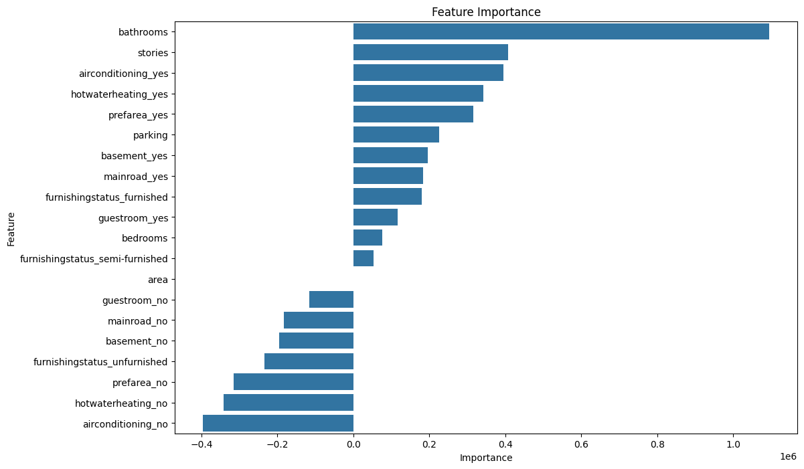

# Linear Regression-Based House Price Prediction


## Table of Contents

- [Introduction](#introduction)
- [Features](#features)
- [Dataset](#dataset)
- [Setup and Installation](#setup-and-installation)
- [Usage](#usage)
- [Model Evaluation](#model-evaluation)
- [Visualization](#visualization)
- [File Descriptions](#file-descriptions)
- [Future Enhancements](#future-enhancements)
- [Contributing](#contributing)
- [License](#license)
- [Acknowledgements](#acknowledgements)

## Introduction

This project aims to predict house prices using a linear regression model. The application is built using Python for the backend and Flask for the web interface. Users can input house features to get an estimated price prediction. This project demonstrates the basics of machine learning, data preprocessing, and web integration for a simple predictive model.

## Features

- **Data Preprocessing**: Handling missing values and converting categorical data into numerical data using one-hot encoding.
- **Model Training**: Utilizing a linear regression model to train on historical house price data.
- **Prediction**: Providing a web interface for users to input house features and get a price prediction.
- **Data Visualization**: Visualizing data and model performance using various plots.

## Dataset

- **Source**: The dataset used for this project is a CSV file named `Housing.csv`.
- **Features**:
  - `area`: Size of the house in square feet.
  - `bedrooms`: Number of bedrooms.
  - `bathrooms`: Number of bathrooms.
  - `stories`: Number of stories.
  - `mainroad`: Access to the main road (Yes/No).
  - `guestroom`: Presence of a guest room (Yes/No).
  - `basement`: Presence of a basement (Yes/No).
  - `hotwaterheating`: Availability of hot water heating (Yes/No).
  - `airconditioning`: Availability of air conditioning (Yes/No).
  - `parking`: Number of parking spaces.
  - `prefarea`: Preferred area location (Yes/No).
  - `furnishingstatus`: Furnishing status of the house (Fully Furnished/Semi-Furnished/Unfurnished).
  - `price`: The price of the house (target variable).

## Setup and Installation

### Prerequisites

- Python 3.7 or later
- Flask
- Pandas
- Scikit-learn
- Joblib
- Matplotlib
- Seaborn

### Installation Steps

1. **Clone the Repository**:
   ```
   git clone https://github.com/yourusername/house-price-prediction.git
   cd house-price-prediction
   ```

2. **Install Dependencies**:
   ```
   pip install -r requirements.txt
   ```

3. **Run Jupyter Notebook for Model Training**:
   Open `Linear_regression_model.ipynb` and run all the cells to train the model and save it.

4. **Start Flask Server**:
   ```
   python app.py
   ```

## Usage

1. **Access the Web Interface**:
   Open your browser and navigate to `http://127.0.0.1:5000/`.

2. **Input House Features**:
   Enter the required features for the house in the form provided.

3. **Predict House Price**:
   Click on the "Predict Price" button to get an estimated price for the house.

## Model Evaluation

- **Mean Squared Error**:
  The model's performance is evaluated using the Mean Squared Error (MSE).

- **Visualization**:
  Various plots are included to visualize the dataset and the model's performance:
  - Correlation Heatmap
  - Distribution of House Prices
  - Residuals Plot
  - Actual vs. Predicted Prices
  - Feature Importance

## Visualization

Here are some of the visualizations included in the project:

- **Correlation Heatmap**:
  

- **Distribution of House Prices**:
  

- **Residuals Plot**:
  

- **Actual vs. Predicted Prices**:
  

- **Feature Importance**:
  

## File Descriptions

- `Linear_regression_model.ipynb`: Jupyter notebook for data preprocessing, model training, and visualization.
- `app.py`: Flask application to serve the model and handle web requests.
- `templates/index.html`: HTML file for the web interface.
- `static/css/styles.css`: CSS styles for the web interface.
- `static/js/script.js`: JavaScript for handling form submission and displaying results.
- `Housing.csv`: Dataset containing house features and prices.
- `feature_names.pkl`: Saved feature names used for the model.
- `linear_regression_model.pkl`: Trained linear regression model.

## Future Enhancements

- **Model Improvement**: Explore other models like Random Forest or Gradient Boosting for better accuracy.
- **Feature Engineering**: Add more features or transform existing ones to improve the model's performance.
- **Deployment**: Deploy the model using platforms like Heroku or AWS for broader accessibility.
- **Enhanced Frontend**: Improve the web interface with more interactive and user-friendly designs.

## Contributing

Contributions are welcome! Please fork the repository and submit a pull request for any improvements or new features.

1. Fork it!
2. Create your feature branch: `git checkout -b my-new-feature`
3. Commit your changes: `git commit -am 'Add some feature'`
4. Push to the branch: `git push origin my-new-feature`
5. Submit a pull request

## License

This project is licensed under the MIT License - see the [LICENSE](LICENSE) file for details.

## Acknowledgements

- Thanks to the open-source community for providing the tools and libraries used in this project.
